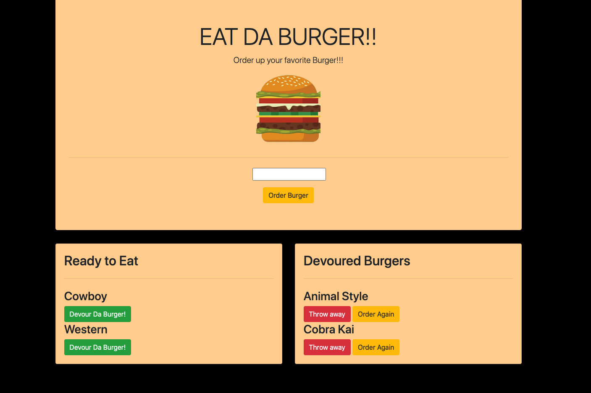

# burger

  
  ## Table of Contests
  -[Description](#description)
  -[Instalation](#install)
  -[Usage](#usage)
  -[Licences](#licences)
  -[Contribution](#contribution)
  -[Test](#tests)
  -[Question](#questions)
  
  
  ## Description
  Keep track of a burger eating contest.

  
  ## Install

  npm install
  
  ## Usage

  
  
  ## Licence

  None
  
  ## Contribution

  
  ## Test
  
  NA
  
  ## Questions

  ### [cfergus7 GitHub](https://github.com/)  
  
  ### Email cfergus7@gmail.com

  ### https://dashboard.heroku.com/apps/arcane-wave-57289

  ## Screen Shots
  